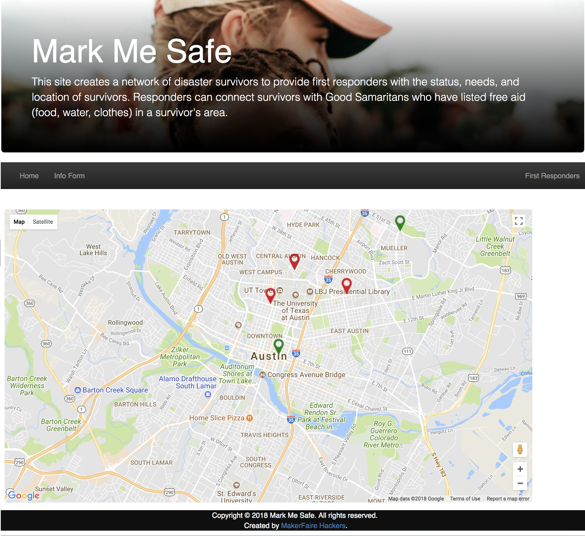
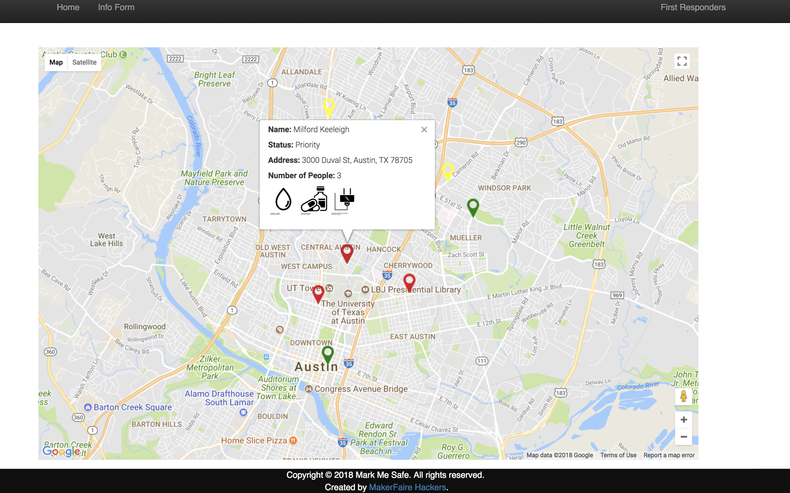
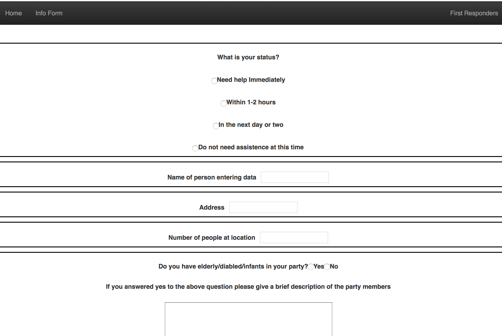
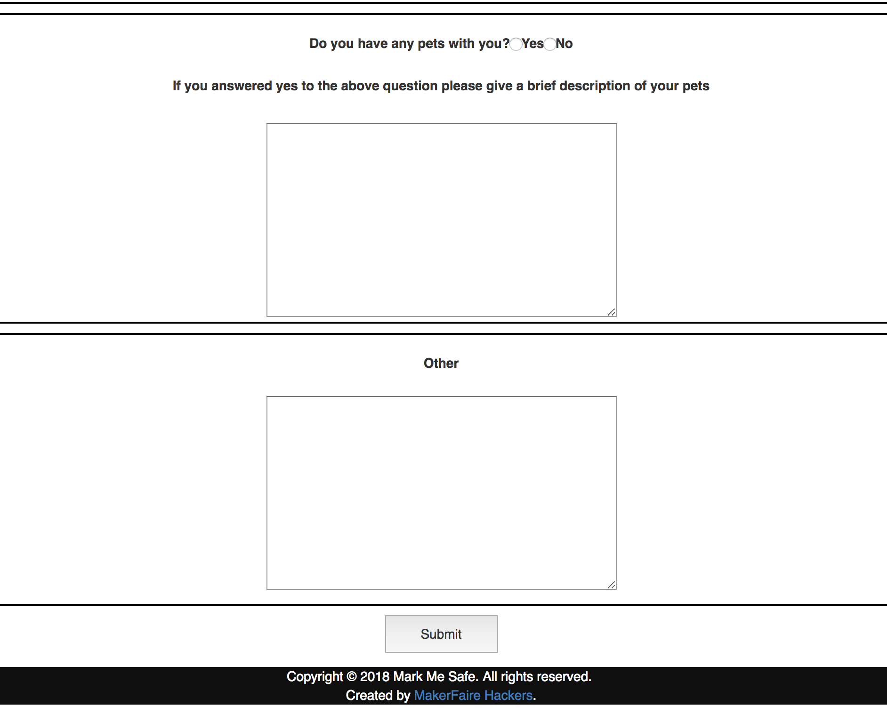

## What is Mark Me Safe?
Mark Me Safe is our solution to a civic challenge presented at the 2018 Disaster Relief Hackathon, hosted by Maker Faire Austin and Experimental Civics. The challenge, Recharge Responsiveness, states:
```First responders are tasked with being responsive as possible during a disaster. Help us hack this challenge by finding ways for communities to better mark their safety to support tools for first responders on the scene.```

## How to use Mark Me Safe:
Click and drag the map to move the view. You can toggle fullscreen on and off on the top right of the map.



******

On the top left, you can toggle terrain on map view and labels on satellite view.  


******

On the bottom right, you can click + or - buttons to zoom in and out, respectively. Drag and drop the yellow figure onto the map for street view.


******

Click the arrow at the top left to return to map view. Click markers to view more information about a person's status.



******

Click info form at the top left of the page.



******

After completing the form, click submit to save and send your information.



## Technologies used:
* [GitHub](https://github.com/)
* [Waffle](https://waffle.io/)
* [Slack](https://slack.com/)
* [React](https://reactjs.org/)
* [React Boostrap](https://react-bootstrap.github.io/)
* [Google Maps React](https://github.com/fullstackreact/google-maps-react)
* [Python](https://www.python.org/)
* Flask
* [SQLite](https://www.sqlite.org/)
* [Mocha](https://mochajs.org/)
* [Jest](https://facebook.github.io/jest/)

## Credits:
* Header, footer, & dynamic map: [fancyaction](https://github.com/fancyaction)
* Intake form & Geolocation [Jaime Pendlebury](https://github.com/eeyorep33)
* Backend & database: [RobertLRead](https://github.com/RobertLRead) & [jendatx](https://github.com/jendatx)
* Testing: [RobertLRead](https://github.com/RobertLRead)
* Project manager, coder reviewer, and documentation: [JessicaSung](https://github.com/JessicaSung)